# SPACE BATTLE

## **Introduction** 

+ Họ và tên: Hoàng Duy Thịnh - K68J - UET

+ Mã sinh viên: 23020708 

+ Bài tập lớn: Space Battle (INT2215_52 - Lập trình nâng cao) 

# Introducing the game

Space Battle thuộc vào thể loại game hành động (action game). Trong game này, người chơi điều khiển một phi cơ và sử dụng vũ khí và các chiêu thức để bắn hạ các kẻ địch để đạt được thời gian sinh tồn cùng số lượng kẻ địch đã bị tiêu diệt nhiều nhất.

- Game có đầy đủ các chức năng hỗ trợ người chơi trong việc thoát game, bắt đầu lại trò chơi. mô tả cách chơi, ngoài sử dụng bàn phím và chuột đơn thuần còn có thể sử dụng Tay cầm để trải nghiệm trò chơi, sử dụng phím ESC để dừng game...

- Có âm thanh sinh động mô tả các chức năng và hành động của trò chơi.
- Video demo cách chơi & giải thích tổng quát source code: [Link demo game](Video deme game & giải thích tổng quát source code (16 phút): https://www.youtube.com/watch?v=98tJ5wg-Tzo)
- (Bổ sung) Video chỉ trải nghiệm game: [Link bổ sung](https://www.youtube.com/watch?v=Ts4eY-ijtz0)

- Thử nghiệm game: 

- [A. Ways to download game](#a-ways-to-download-game)
    * [1. Method 1: No code included.](#a-cách-1-không-bao-gồm-code)
    * [2. Method 2: Include code and compilable.](#b-cách-2-bao-gồm-code-và-có-thể-biên-dịch)
- [B. Instrucsion and Start Game](#b-instrucsion-and-start-game)
- [C. End Game](#c-end-game)
- [D. Components In Game](#d-components-in-game)
- [E. Skill Items In Game](#e-skill-items-in-game)
- [F. Supplemt](#f-supplemt)
- [Soure code & Reference source](#soure-code--reference-source)
- [Development & Conclusion](#development--conclusion)

# A. Ways to download game

## 1. Method 1: No code included.

Tải game (được nén thành .zip) tại link sau: https://drive.google.com/file/d/11EsklsY-lR6tmu-lY51UEbFQaIKGhLdF/view?usp=sharing

Giải nén game vào một thư mục và bật run.exe lên và chơi.

## 2. Method 2: Include code and compilable.

**Step 1:** Clone repo này về môi trường **Visual Studio Code**: [Link Repository](https://github.com/mrthinh307/TankGme)

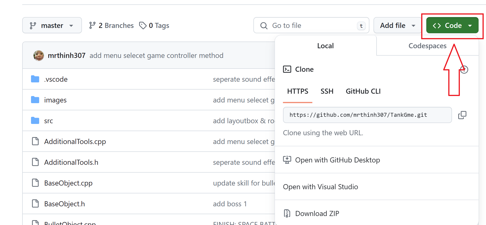

**Step 2:** Mở **Terminal** dẫn đến file của game (có thể sử dụng tổ hợp phím **Ctrl + ALt + N**) điền chữ **make** sau đó nhấn **Enter**, chờ khoảng 10s và trải nghiệm trò chơi.

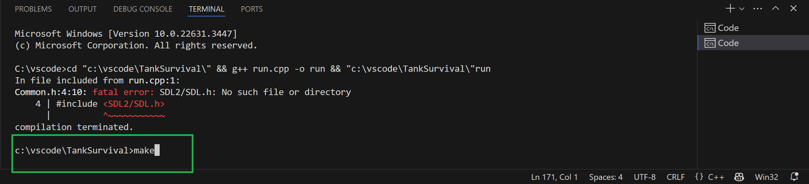

# B. Instrucsion and Start Game

- Sau khi mở trò chơi thành công, sẽ xuất hiện màn hình chờ của game:
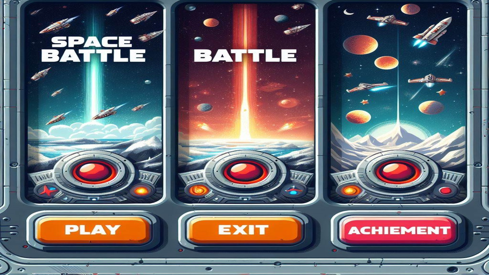

**1. PLAY**

- Khi người chơi nhấn vào nút **PLAY** - có nghĩa rằng xác nhận tham gia trò chơi, màn hình sẽ dẫn người chơi đến phần chọn chức năng điều khiển.

- Trò chơi cung cấp cho người chơi 2 sự lựa chọn trong chức năng điều khiển cho phi cơ gồm:
    + **Bàn phím và Chuột**.
    + **Tay cầm (XBox, PS4, PS5...)** ( dưới đây là hướng dẫn nút điều khiển cho tay cầm thuộc họ **XBox**, các loại tay cầm khác điều khiển tương tự) . Đối với các tay cầm có hỗ trợ tính năng rung, mình cùng đã cài đặt để khi **va chạm** với kẻ địch hiệu ứng **rung tay cầm** trong 500ms. 
    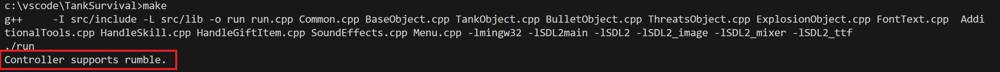

### *Control + Shoot ( Điều khiển và Bắn đạn)* 

| Control | Keyboard | Gamepads | 
|---------|----------|----------|
| UP      |     W    |Joysticks |
| DOWN    |     S    |Joysticks |
| LEFT    |     A    |Joysticks |
| RIGHT   |     D    |Joysticks |

|  Shoot  | Mouse    | Gamepads | 
|---------|----------|----------|
| Normal  |LeftMouse |    (A)   |
| Ulti    |RightMouse|    (B)   |

- Người chơi chọn chức năng điều khiển nào thì nhấn chuột vào **thanh mô tả** của chức năng đó:

- VÀO GAME

- Người chơi sẽ điều khiển nhân vật được xuất hiện ở giữa màn hình:

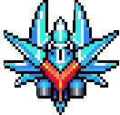

**2. EXIT**

- Khi người chơi nhấn vào nút **EXIT** - cửa sổ trò chơi được đóng lại và trò chơi kết thúc.

**3. ACHIEVEMENT** - Chức năng sao lưu
- Chức năng này lưu lại kỉ lục về số kẻ địch mà người chơi hạ gục được trong một lần chơi.
- Chức năng **LEVEL** biểu tượng cho kinh nghiệm trò chơi mà người chơi tích lũy được. Sẽ tăng cấp khi số Vàng người chơi tích lũy qua các lần chơi đạt đến 500.
- Chức năng update **nâng cấp hoàn toàn ngoại hình** Phi cơ khi nâng cấp Level. Tất cả các phi cơ đều có các **hoạt ảnh** ánh sáng óng ánh sinh động
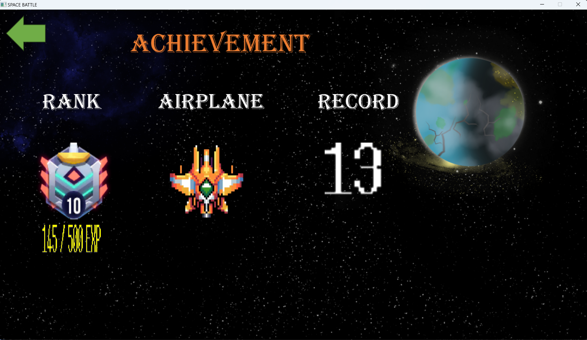
# C. End Game
- Ghi lại thành tựu sau một ván chơi mà người chơi đạt được: 
+ Số kẻ địch mà người chơi hạ gục.
+ Số lượng vàng thu thập được.
+ Thời gian sinh tồn.
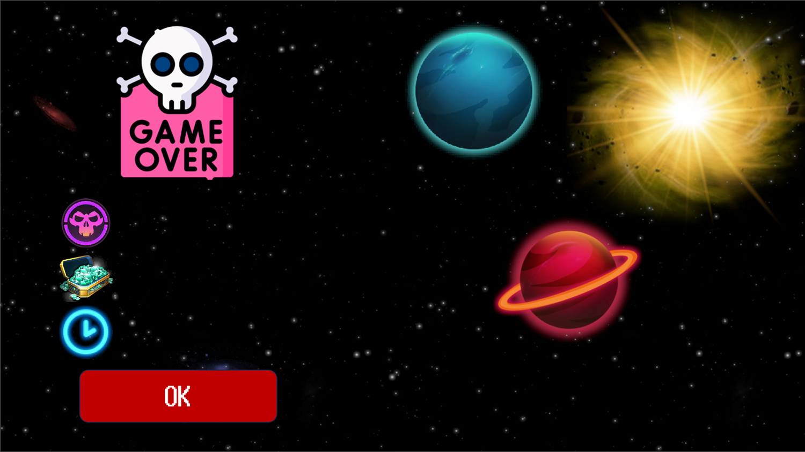

# D. Components In Game

-    Tank Object 
     : là đối tượng người chơi điều khiển 

-    Mini Enemy 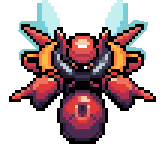
     : là đối tượng kẻ địch con, **sẽ tăng thêm 1 đối tượng sau 30s đầu tiên của game, và sau lần xuất hiện đầu tiên của Boss sẽ là 60s cho mỗi lần tăng thêm**.

-   ***Boss*** 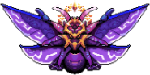: là đối tượng kẻ địch mạnh. Sẽ xuất hiện lại sau mỗi 60s.

    - ***Blood bar of boss*** : là thanh máu của Boss, giảm 1 đơn vị máu khi boss trúng đạn **Normal** và 2 đơn vị máu khi là **Ulti**.
    
- ***Timer*** (Bộ đếm thời gian) : Ghi lại thời gian sinh tồn của người chơi.

- ***Killed enemy icon*** (Số lượng kẻ địch bị tiêu diệt) : Ghi lại số lượng kẻ địch đã bị người chơi tiêu diệt

- ***Ulti***(Rocket) : số lượng Rocket người chơi có( tăng thêm 1 sau mỗi 5 kẻ địch bị tiêu diệt). Khác với đạn thường Rocket có khả năng xuyên thấu kẻ địch, ngoại trừ **Boss** nhưng cũng có sát thương lên Boss cao hơn.

- ***Heart***(Mạng): : số lượng mạng của phi cơ ( -1 <=> va chạm với kẻ địch / trúng đạn kẻ địch).
- ***Controller Method***(Phương thức điều khiển): Cho người chơi nhận biết đang sử dụng cách thức điều khiển nào! Biểu tượng hình Bàn phím  <=> Phương thức: **Chuột và bàn phím**, biểu tượng hình tay cầm  <=> Phương thức: **Tay cầm**.

- ***Pause Button*** (Nút dừng game): Nếu muốn tạm dừng trò chơi hoặc chơi lại khi đang trong trò chơi, người chơi có thể ấn nút **ESC**, cửa sổ game sẽ hiện lên trang Setting:

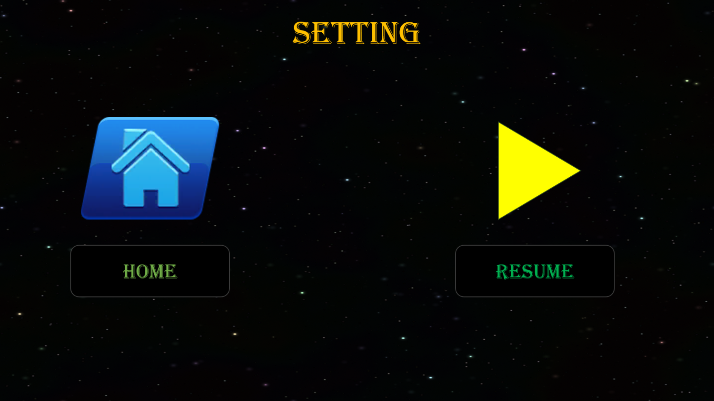
- Ấn chuột vào mục **HOME** sẽ đưa người chơi về cửa sổ MENU ban đầu. Người chơi có thể nhấn PLAY để chôi lại.
- Ấn chuột vào mục **RESUME** để tiếp tục trò chơi đang tạm dừng,

- Cùng một số thành phần khác...

- Bố cục game cơ bản:

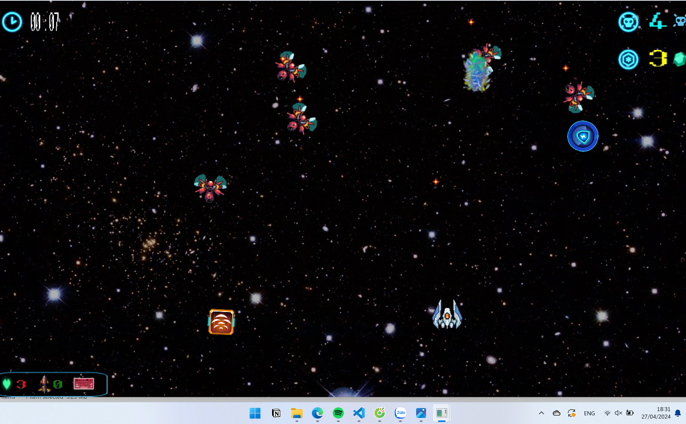

- Nếu như bạn đang thắc mắc những biểu tượng màu sắc xuất hiện ở giữa màn hinhg game ở trên là gì? Thì đó chính là tính năng giúp người chơi trải nghiệm thoải mái với bộ hơn 20 skills (có phát triển thêm trong tương lai) cho nhân vật chính, tất cả các skills đều kèm theo hiệu ứng hình ảnh cùng âm thanh phù hợp.

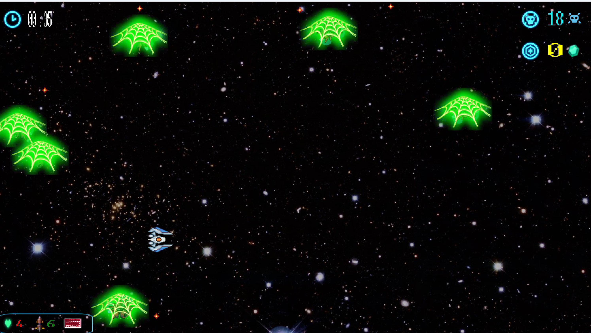
- example : Skill làm trói làm choáng kẻ địch

# E. Skill Items In Game

Tấn công kẻ địch bằng đạn hoặc sử dụng các skill, không cho kẻ địch hay đạn của kẻ địch chạm vào phi cơ. Nếu chạm vào số mạng sống sẽ giảm đi 1 (góc trái bên dưới cửa sổ trò chơi). Mặc định ban đầu khi bắt đầu trò chơi người chơi sở hữu 3 mạng.  

Trò chơi kết thúc khi số mạng của người chơi còn **0**.

## 1. Some Skills(Một số loại Skills)

Icon của skill xuất hiện random với tỉ lệ ngẫu nhiên sau khi tiêu diệt kẻ địch ( có thể có có thể không). Người chơi di chuyển phi chạm vào icon tự động kích hoạt Skill:

|                                                                             | Tên cây	     | Chức năng                                                                                                                    |
|-----------------------------------------------------------------------------|--------------|------------------------------------------------------------------------------------------------------------------------------|
|   | Straight Beam	  | Đường đạn thay đổi thành một chùm đạn gồm 4 cột đạn thẳng hàng (30S).                                                                                             |
| 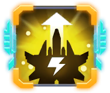    | Booster	   | Tăng gấp đôi tốc độ cho phi cơ (10s).                                                                                              |
|           | Wall-nut	    | Đạn bắn ra từ 4 phía của phi cơ mỗi viên lệch nhau 90 độ (30s).                                                    |
| 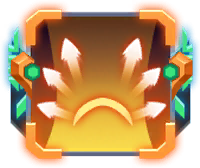        | Đạn Loang 	    | Đạn bắn ra theo 3 đường xiên hướng từ đầu của phi cơ đi ra(30s). |
|  | Default Mode  | Đưa phi cơ về chế độ mặc định, xóa mọi skills hiện có, vô hiệu hóa khả năng kích hoạt các skill mới trong (10s).                                                               |
|   | HP	 | Ngay lập tức cộng một mạng sống cho phi cơ.      
|   | Green Diamond Bullet	 | Đạn của phi cơ được nâng cấp về các chỉ số / chuyển đổi sang dạng mới.      
|   | Đạn hình xuyến	 | Đạn của phi cơ được nâng cấp các chỉ số / chuyển đổi sang dạng mới.  
|   | Phi tiêu | Đạn của phi cơ được nâng cấp về các chỉ số / chuyển đổi sang dạng mới.  
|   | Add Rocket	 | Số Rocket (Utils) được cộng thêm random 1 số <10.  
| 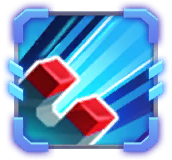  | Magnet	 | Thỏi nam châm trong không gian sẽ  hút tất các các skill tồn tại trên màn hình trò chơi về đối tượng Phi Cơ người chơi(30s).  
|   | Upgrade Rocket	 | Chiêu thức Rocket(Ulti) của phi cơ được nâng cấp lên dạng mới nhanh hơn, sát thương diện rộng hơn.                                                            |
|   | Shield	 | Kích hoạt thần hộ mệnh, vô hiệu hóa va chạm với kẻ địch(10s).                                                            |
|   | Stun 	 | Trói buộc kẻ địch, gây choáng và không thể di chuyển(5s)                                                         |
|   | Super Bullet | Đúng như cái tên của nó, đường đạn bắn ra vô cùng ảo ma Canada =)).                                                            |
| 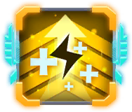  | Teleport	 | Dúng như cái tên của nó, 1 vị trí bất kì trong cửa số trò chơi được lựa chọn và phi cơ sẽ teleport đến vị trí đó.                                                            |
| 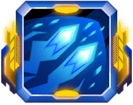  | Trap Bullet	 | Đạn được bắn ra sẽ xoay tròn tại vị trí đó, tạo lên bẫy khiến kẻ địch chạm phải.                                                            |
|   | Icon Ruby Nói Chung	 | Người chơi thu thập Ruby để tích lũy kinh nghiệm.                                                            |

- Và một số skill thú vị khác, người chơi sẽ được trải nghiệm khi tham gia trò chơi.
- Tất cả các skills được cài đặt đều bao gồm các hoạt ảnh, âm thanh sinh động.
- Sau khi xuất hiện, các icon skill sẽ vỡ tan (mất đi) nếu sau 1 khoảng thời gian đã set mặc định hoặc khi kẻ địch va chạm.

# F. Supplement

## See Also

### *Các kỹ thuật sử dụng*
- Thư viện SDL2.0.

- Sử dụng nhiều class, vector, tách file, kế thừa....

- Tối ưu việc tạo nhiều đối tượng bằng cách reset random vị trí của kẻ địch di chuyển từ sau 4 phía màn hình sau khi bị hạ, đạn của kẻ địch cũng xử lý tương tự.

- Vận dụng kiến thức toán học để tính toán được góc xoay, sự di chuyển của các kẻ địch hướng về phía người chơi nhưng không di chuyển chồng lên nhau. Set cho đường đạn của kẻ địch hướng một cách tương đối về hướng phi cơ, vừa tạo ra độ khó, độ bất ngờ nhưng cũng giữ được mức độ cân bằng cho trò chơi. Tính toán sự di chuyển và xuất hiện cho đạn của phi cơ góp phần tạo nên các skill bắn đạn độc đáo.

- Xử lý thời gian, thao tác chuột và bàn phím, tay cầm, âm thanh, hình ảnh chuyển động, chữ. Quản lý địa chỉ và bộ nhớ khi thao tác với các biến như con trỏ... tránh gây thất thoát, rò rỉ bộ nhớ. 

- Tạo menu, các tính năng pause game, chơi lại game, ghi lại kỉ lục, sao lưu các thống số cần thiết để tạo ra tính năng Level và nhận Phi cơ mới, xử lý các nút ấn di chuyển giữa các menu. 

- Xử lý sự kiện chuột, bàn phím, tay cầm, chức năng rung của tay cầm ( nếu có ).

### Soure code & Reference source

#### 1. Source code :
- Trình bày thông qua clip demo game.
#### 2. Nguồn tham khảo:
- Cách sử dụng, cài đặt SDL2.0 trên môi trường VSCODE và CodeBlock.

- Cách sử dụng thư viện SDL2.0, quản lý chương trình: Tham khảo trên lazyfoo và các video của cô Trần Thị Minh Châu, Stack Overflow, kênh youtube: Phát triển phần mềm AZ123, codegopher, Let's Make Games,...

- Hình ảnh: Tìm kiếm trên Google kết hợp tự design.
- Âm thanh: Tra trên Google

# Development & Conclusion

## Hướng phát triển:

- Điều chỉnh độ khó cho game: Người chơi có thể lựa chọn số kẻ địch ban đầu xuất hiện. Không chỉ người chơi mà kẻ địch cũng có thể ăn những skill rơi ra, phù hợp với đối tượng kẻ địch mà update tính năng skill đó lên kẻ địch làm trò chơi trở nên thú vị hơn.

- Cập nhật tính năng bảng xếp hạng, sau mỗi lần chơi người chơi sẽ được nhập tên để lưu lại kết quả chơi của mình.

- Phát triển tính năng Multiplayer:
    + 2 PLAYERS VERSUS ENEMY( Đua nhau về số kẻ địch hạ gục or Thời gian sinh tồn (Có xử lý va chạm giữa 2 players)/ Cùng phe(không xử lý va chạm))
    + PLAYER 1 VS PLAYER 2(Thiết lập thanh blood_bar như boss, xử lý va chạm như, ăn skill và chiến đấu lẫn nhau.)

- Update thêm những skills mới.

## Sau gần 2 tháng làm game cho bài tập lớn:

- Em thấy mình đã cải thiện được rất nhiều kỹ năng trong việc tư duy thuật toán và viết code, khả năng lên ý tưởng, xây dựng kế hoạch và thực hiện từng bước một.

- Học được cách setup môi trường, sử dụng thư viện ngoài. Quản lý bộ nhớ với các biến địa chỉ, con trỏ, việc cấp phát động... 

- Vận dụng các kiến thức các môn đại cượng vào chương trình.

- Học cách thực hiện nhiệm vụ cá nhân, tìm tòi và học hỏi từ nhiều nguồn tài liệu.

**The end! **

***THANKS FOR READING MY README.***

